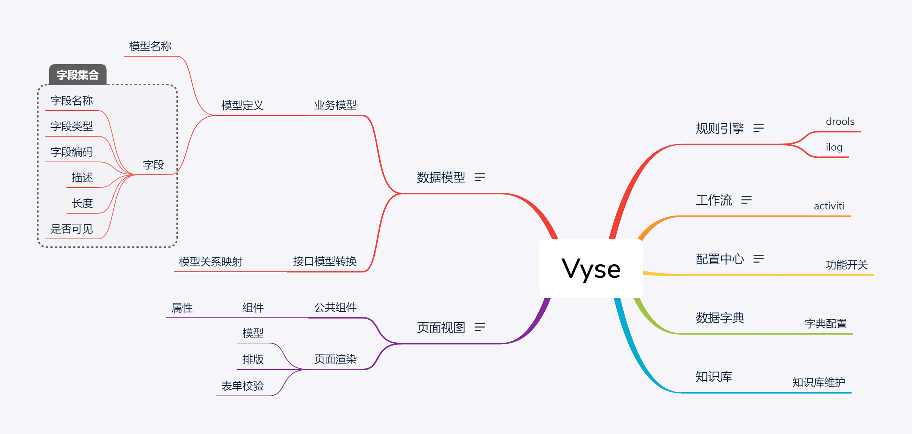

# Vyse

## 大纲

## 规则引擎

规则脚本

### drools

### ilog

## 工作流

工作流定义
页面视图配合工作流进行流转

### activiti

## 配置中心

对功能进行开关控制
配置业务键值

### 功能开关

## 数据字典

### 字典配置

## 知识库

### 知识库维护

## 页面视图

页面的配置化
页面组件公共化

### 公共组件

- 组件

	- 属性

### 页面渲染

- 模型
- 排版
- 表单校验

## 数据模型

业务模型的定义
接口模型的转换

### 业务模型

- 模型定义

	- 模型名称
	- 字段

		- 字段名称
		- 字段类型
		- 字段编码
		- 描述
		- 长度
		- 是否可见

### 接口模型转换

- 模型关系映射

## 名词描述

*spec* 全文*specification* [ˌspesɪfɪˈkeɪʃn] 大意为规范

*act* 全文*actual* [ˈæktʃuəl] 大意为真实的